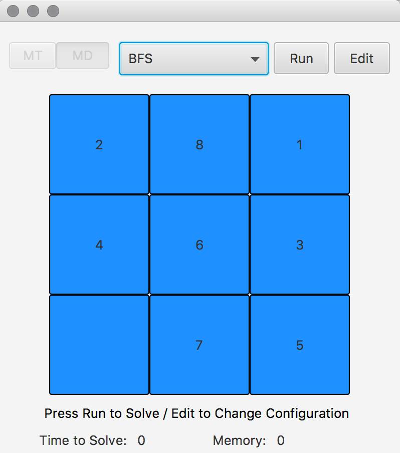
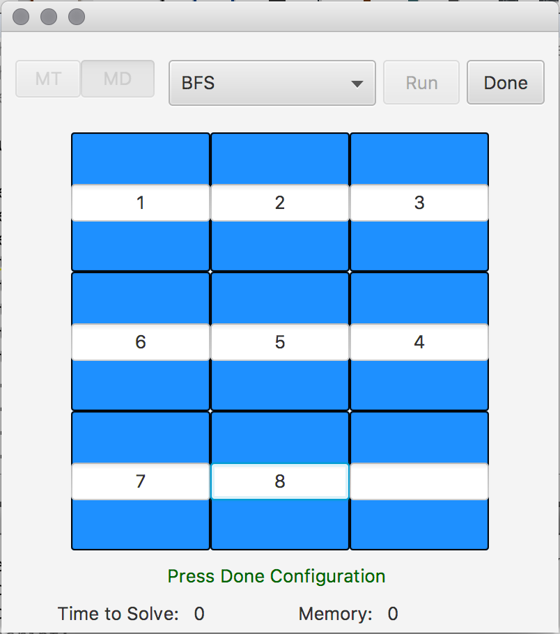
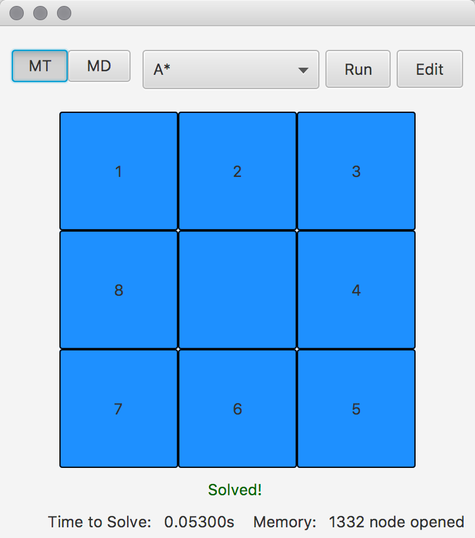

# 8Puzzle
solving 8 Puzzle with A*, Recursive Best First Search and BFS 

## Documentation

  PuzzleNode Class :
  
  - For holding data of each state and checking whether it reached the goal or not

  ProblemTree Class:
  
  - Solve the problem depend on the given method.
    - BFS: Simple bfs search on the problem tree until reach goal state
    - A*: Only open nodes with minimum heuristic value (depend on heuristic choosen (Missplace Tiles or Manhatan Distance) + nodeDepth).
    - Recursive Best First Search: Recursively expanding the most promising node chosen according to a specified heuristic function.
  
  Heuristic Class:
  
  - calculating heuristic for given state.
  

## Example

##Press Edit button to input your puzzle##

##Then press Done button to save the changes##

##Finally press Run button and choose the method for solving the puzzle##

## Author

  - Soheil Changizi ( [@cocolico14](https://github.com/cocolico14) )

## License

This project is licensed under the MIT License - see the [LICENSE](./LICENSE) file for details

